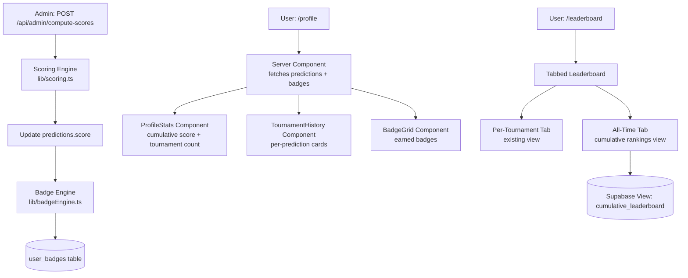

# Design Document: Gamification & Profiles

## Overview

This feature extends the Chess Predictor platform with persistent user profiles, cumulative scoring, and an achievement badge system. The goal is to increase retention by giving users a sense of progression across tournaments.

The implementation builds on the existing Supabase + Next.js App Router stack. It introduces:

- A `user_badges` table for badge persistence
- A `BadgeEngine` server-side service that evaluates and awards badges after scoring
- An enhanced `/profile` page showing cumulative stats, tournament history, and earned badges
- An enhanced `/leaderboard` page with a tabbed all-time cumulative view

No new authentication mechanism is needed — the existing Supabase Auth session is used throughout.

---

## Architecture



The Badge Engine is invoked server-side at the end of the existing `compute-scores` API route. It is a pure TypeScript module — no new API route is needed for badge evaluation.

---

## Components and Interfaces

### BadgeEngine (`lib/badgeEngine.ts`)

```typescript
export type BadgeType =
  | "sharp_eye" // ≥1 exact position match
  | "perfect_call" // maximum possible score
  | "seasoned_analyst" // scored predictions in ≥3 distinct tournaments
  | "podium_finish"; // top-3 on tournament leaderboard

export interface BadgeAwardContext {
  userId: string;
  userName: string;
  tournamentId: string;
  tournamentName: string;
  prediction: Prediction;
  officialStandings: PlayerEntry[];
  allUserPredictions: Prediction[]; // all scored predictions for this user
  tournamentLeaderboard: { userName: string; score: number }[];
}

export async function evaluateAndAwardBadges(
  ctx: BadgeAwardContext,
  supabaseAdmin: SupabaseClient,
): Promise<void>;
```

Internally, `evaluateAndAwardBadges` calls individual condition checkers:

- `checkSharpEye(prediction, officialStandings): boolean`
- `checkPerfectCall(prediction, officialStandings): boolean`
- `checkSeasonedAnalyst(allUserPredictions): boolean`
- `checkPodiumFinish(userName, tournamentLeaderboard): boolean`

Each checker is a pure function, making them independently testable.

### Profile Page (`app/profile/page.tsx`)

Converted to a **Server Component** that fetches data server-side via `supabase-server.ts`. Sub-components:

- `ProfileStats` — displays cumulative score and tournament count
- `TournamentHistoryList` — renders prediction cards with scores/awaiting state
- `BadgeGrid` — renders earned badge chips with name, description, and optional tournament name

### Leaderboard Page (`app/leaderboard/page.tsx`)

Extended with a tab switcher:

- **"This Tournament"** tab — existing per-tournament ranked list (unchanged)
- **"All Time"** tab — queries the `cumulative_leaderboard` Supabase view

### New UI Component: `BadgeChip`

A small presentational component rendering a badge icon, name, and description. Uses the existing `Badge` component from `components/ui/badge.tsx` as a base.

---

## Data Models

### New Table: `user_badges`

```sql
CREATE TABLE user_badges (
  id             uuid DEFAULT gen_random_uuid() PRIMARY KEY,
  user_id        uuid NOT NULL REFERENCES auth.users(id) ON DELETE CASCADE,
  badge_type     text NOT NULL CHECK (badge_type IN (
                   'sharp_eye', 'perfect_call', 'seasoned_analyst', 'podium_finish'
                 )),
  tournament_id  text REFERENCES live_standings(tournament_id) ON DELETE SET NULL,
  awarded_at     timestamp with time zone NOT NULL DEFAULT timezone('utc', now()),
  CONSTRAINT uq_user_badge_tournament UNIQUE (user_id, badge_type, tournament_id)
);

ALTER TABLE user_badges ENABLE ROW LEVEL SECURITY;

-- Users can only read their own badges
CREATE POLICY "Users read own badges" ON user_badges
  FOR SELECT USING (auth.uid() = user_id);

-- Only service role can insert/update badges
CREATE POLICY "Service write badges" ON user_badges
  FOR ALL TO service_role USING (true) WITH CHECK (true);
```

The `tournament_id` column is nullable to support the `seasoned_analyst` badge, which is not tied to a specific tournament.

### New Supabase View: `cumulative_leaderboard`

```sql
CREATE VIEW cumulative_leaderboard AS
SELECT
  user_name,
  COALESCE(SUM(score), 0)          AS cumulative_score,
  COUNT(DISTINCT tournament_name)  AS tournaments_played
FROM predictions
WHERE score IS NOT NULL
GROUP BY user_name
ORDER BY cumulative_score DESC, tournaments_played DESC;
```

This view is queried by the All-Time leaderboard tab. It is computed on-the-fly from the `predictions` table, so it always reflects the latest scored data without a separate sync step.

### Updated `predictions` Table

No schema changes required. The existing `score`, `user_name`, and `tournament_name` columns are sufficient. The profile page will join against `live_standings` by `tournament_name` to resolve display names (already present in the existing profile page logic).

### TypeScript Type Extensions (`lib/types.ts`)

```typescript
export type BadgeType =
  | "sharp_eye"
  | "perfect_call"
  | "seasoned_analyst"
  | "podium_finish";

export interface UserBadge {
  id: string;
  user_id: string;
  badge_type: BadgeType;
  tournament_id: string | null;
  awarded_at: string;
}

export interface CumulativeLeaderboardEntry {
  user_name: string;
  cumulative_score: number;
  tournaments_played: number;
}

export const BADGE_METADATA: Record<
  BadgeType,
  { name: string; description: string }
> = {
  sharp_eye: {
    name: "Sharp Eye",
    description: "Predicted at least one player in the exact correct position.",
  },
  perfect_call: {
    name: "Perfect Call",
    description: "Achieved the maximum possible score for a tournament.",
  },
  seasoned_analyst: {
    name: "Seasoned Analyst",
    description:
      "Submitted scored predictions for 3 or more distinct tournaments.",
  },
  podium_finish: {
    name: "Podium Finish",
    description: "Finished in the top 3 on a tournament leaderboard.",
  },
};
```

---

## Correctness Properties

_A property is a characteristic or behavior that should hold true across all valid executions of a system — essentially, a formal statement about what the system should do. Properties serve as the bridge between human-readable specifications and machine-verifiable correctness guarantees._

### Property 1: Prediction list is ordered by submission date descending

_For any_ non-empty list of predictions returned for a user's profile, each prediction's `created_at` timestamp SHALL be greater than or equal to the `created_at` of the prediction that follows it in the list.

**Validates: Requirements 1.1**

### Property 2: Cumulative score equals sum of non-null prediction scores

_For any_ collection of predictions with a mix of null and non-null `score` values (including the all-null case), the computed cumulative score SHALL equal the arithmetic sum of all non-null `score` values, and SHALL be 0 when all scores are null.

**Validates: Requirements 2.1, 2.2**

### Property 3: Tournament participation count equals distinct tournament names

_For any_ collection of a user's predictions, the tournaments-participated count SHALL equal the number of distinct `tournament_name` values present in that collection.

**Validates: Requirements 2.4, 6.4**

### Property 4: Sharp Eye badge condition — exact rank match

_For any_ prediction ranked list and official standings, `checkSharpEye` SHALL return `true` if and only if at least one player in the prediction occupies the same rank position in the official standings.

**Validates: Requirements 3.2**

### Property 5: Perfect Call badge condition — maximum possible score

_For any_ prediction and official standings, `checkPerfectCall` SHALL return `true` if and only if `computeScore(prediction, officialStandings)` equals `3 × len(officialStandings)` (every player exactly matched, yielding the maximum achievable score).

**Validates: Requirements 3.3**

### Property 6: Seasoned Analyst badge condition — three or more distinct tournaments

_For any_ collection of scored predictions for a user, `checkSeasonedAnalyst` SHALL return `true` if and only if the number of distinct tournament names among those predictions is ≥ 3.

**Validates: Requirements 3.4**

### Property 7: Podium Finish badge condition — top-3 leaderboard rank

_For any_ tournament leaderboard (list of users with scores) and a given user name, `checkPodiumFinish` SHALL return `true` if and only if the user's position in the leaderboard sorted by score descending is ≤ 3.

**Validates: Requirements 3.5**

### Property 8: Badge award idempotency — no duplicate records

_For any_ sequence of one or more `evaluateAndAwardBadges` calls for the same (user, badge_type, tournament_id) triple, the resulting set of badge records SHALL contain exactly one entry for that triple — repeated calls SHALL be no-ops.

**Validates: Requirements 3.6, 5.3**

### Property 9: Badge rendering completeness — all earned badges displayed with full metadata

_For any_ non-empty set of user badges, the rendered badge grid SHALL contain one rendered element per badge; each element SHALL include the badge's name and description from `BADGE_METADATA`; and for any badge with a non-null `tournament_id`, the rendered element SHALL also include the associated tournament name.

**Validates: Requirements 4.1, 4.3, 4.4**

### Property 10: Cumulative leaderboard ordering invariant

_For any_ two adjacent entries A and B in the cumulative leaderboard (A appearing before B), either A's `cumulative_score` is strictly greater than B's, or their `cumulative_score` values are equal and A's `tournaments_played` is greater than or equal to B's.

**Validates: Requirements 6.1, 6.2**

---

## Error Handling

### Badge Engine Failures

- If a badge insert fails due to a race condition (duplicate key), the engine catches the unique-constraint violation and treats it as a no-op (idempotent).
- If the Supabase admin client returns an unexpected error during badge insert, the error is logged server-side and the `compute-scores` route returns a partial-success response indicating how many badges were awarded vs. failed.
- Badge evaluation failures do NOT roll back score updates — scores are committed first, badges are best-effort.

### Profile Page Data Fetching

- If the Supabase query for predictions fails, the page renders an error state with a retry prompt.
- If the `user_badges` query fails independently, the profile renders predictions/stats normally and shows a "badges unavailable" fallback in the badge section.
- Missing `tournament_name` join results (e.g., a tournament deleted from `live_standings`) fall back to displaying the raw `tournament_name` string stored on the prediction.

### Leaderboard Cumulative View

- If the `cumulative_leaderboard` view query fails, the All-Time tab renders an error state without affecting the per-tournament tab.
- Users with zero scored predictions are excluded from the view (they have no rows); the UI handles an empty result set gracefully.

---

## Testing Strategy

### Unit Tests

Focus on the pure condition-checker functions in `lib/badgeEngine.ts`:

- `checkSharpEye`: test with exact match present, no exact match, empty standings
- `checkPerfectCall`: test with perfect score, partial score, zero score
- `checkSeasonedAnalyst`: test with 0, 1, 2, 3, and 4 distinct tournaments
- `checkPodiumFinish`: test with user in 1st, 3rd, 4th, and tied positions
- `computeCumulativeScore`: test with all-null scores, mixed, all scored

### Property-Based Tests

Using `fast-check` for TypeScript, with a minimum of 100 iterations per property:

- **Property 1** — Generate random prediction arrays with random `created_at` values; sort them; assert each element's timestamp ≥ the next.
  - Tag: `Feature: gamification-profiles, Property 1: Prediction list is ordered by submission date descending`
- **Property 2** — Generate random arrays of predictions with mixed null/non-null integer scores; assert cumulative score equals manual sum of non-null values.
  - Tag: `Feature: gamification-profiles, Property 2: Cumulative score equals sum of non-null prediction scores`
- **Property 3** — Generate random prediction arrays with varying `tournament_name` distributions; assert tournament count equals distinct name count.
  - Tag: `Feature: gamification-profiles, Property 3: Tournament participation count equals distinct tournament names`
- **Property 4** — Generate random predictions and standings; assert `checkSharpEye` iff any (player.id, player.rank) pair matches in both lists.
  - Tag: `Feature: gamification-profiles, Property 4: Sharp Eye badge condition — exact rank match`
- **Property 5** — Generate random standings; construct perfect and imperfect predictions; assert `checkPerfectCall` matches whether score equals max.
  - Tag: `Feature: gamification-profiles, Property 5: Perfect Call badge condition — maximum possible score`
- **Property 6** — Generate random prediction arrays with varying numbers of distinct tournament names; assert `checkSeasonedAnalyst` iff distinct count ≥ 3.
  - Tag: `Feature: gamification-profiles, Property 6: Seasoned Analyst badge condition — three or more distinct tournaments`
- **Property 7** — Generate random leaderboards with varying score distributions; assert `checkPodiumFinish` iff user's sorted rank ≤ 3.
  - Tag: `Feature: gamification-profiles, Property 7: Podium Finish badge condition — top-3 leaderboard rank`
- **Property 8** — Simulate multiple `evaluateAndAwardBadges` calls for the same (user, badge_type, tournament_id); assert badge list contains exactly one entry.
  - Tag: `Feature: gamification-profiles, Property 8: Badge award idempotency — no duplicate records`
- **Property 9** — Generate random sets of user badges; render the badge grid; assert one element per badge with correct name, description, and tournament name where applicable.
  - Tag: `Feature: gamification-profiles, Property 9: Badge rendering completeness — all earned badges displayed with full metadata`
- **Property 10** — Generate random user prediction data; build the leaderboard; assert ordering invariant holds for every adjacent pair.
  - Tag: `Feature: gamification-profiles, Property 10: Cumulative leaderboard ordering invariant`

### Integration Tests

- Verify the `compute-scores` route correctly invokes badge evaluation after score updates (1-2 representative examples with a test Supabase project or mocked admin client).
- Verify the `user_badges` unique constraint prevents duplicate inserts at the database level.
- Verify RLS: a user can read only their own badge rows.

### Snapshot / UI Tests

- Profile page renders correctly with zero badges, one badge, and multiple badges.
- Leaderboard tab switcher renders both tabs and defaults to the per-tournament view.
