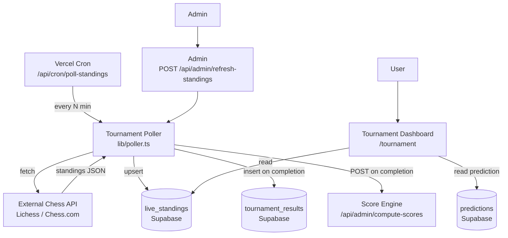

# Design Document: Live Tournament Integration

## Overview

This feature connects the Chess Predictor app to an external chess API (Lichess or Chess.com) to display live and final tournament standings. It introduces a polling service, a caching layer in Supabase, a new `/tournament` dashboard page, and automatic score computation when a tournament completes.

The design follows the existing patterns in the codebase: Next.js App Router server components for data fetching, `supabaseAdmin` for server-side writes, Vercel Cron Jobs for scheduled polling, and the existing `computeScore` / `POST /api/admin/compute-scores` pipeline for scoring.

### Key Design Decisions

- **Vercel Cron Jobs** drive the polling schedule. A single cron route (`/api/cron/poll-standings`) is invoked by Vercel on a configurable schedule. This avoids running a persistent background process and fits the serverless deployment model.
- **Adaptive polling intervals** are implemented by checking `Tournament_Status` at the start of each cron invocation and returning early (no-op) when the tournament is `upcoming` and the reduced interval has not elapsed, or `completed`.
- **Supabase `live_standings` table** acts as the cache. All page reads go to Supabase, never directly to the External_API, keeping page load times fast and decoupled from third-party availability.
- **Score computation is triggered server-side** by the poller itself (via an internal HTTP call to the existing `/api/admin/compute-scores` endpoint) when it detects a `completed` transition, rather than via a database trigger, to keep logic in one place and leverage the existing endpoint.
- **Idempotency guard**: a `scored_at` timestamp column on `live_standings` prevents the Score_Engine from being invoked more than once per tournament.

---

## Architecture



### Request Flow — Cron Poll

1. Vercel invokes `GET /api/cron/poll-standings` on schedule.
2. The route validates the `CRON_SECRET` header and calls `pollStandings()` from `lib/poller.ts`.
3. `pollStandings()` reads the current `live_standings` row to determine `Tournament_Status` and last fetch time.
4. If the status is `completed`, it returns immediately (no-op).
5. If the status is `upcoming` and fewer than 60 minutes have elapsed since the last fetch, it returns immediately.
6. Otherwise it calls the External_API with a 10-second timeout.
7. On success: transforms the response, upserts `live_standings`, and checks for a `completed` transition.
8. On `completed` transition: inserts into `tournament_results` and calls `POST /api/admin/compute-scores` internally.
9. On failure: logs the error and returns without overwriting cached standings.

---

## Components and Interfaces

### `lib/poller.ts` — Core Polling Logic

```typescript
export interface PollResult {
  status: "updated" | "skipped" | "error";
  fetchedAt?: string; // ISO timestamp of successful fetch
  errorMessage?: string;
}

export async function pollStandings(tournamentId: string): Promise<PollResult>;
```

Responsibilities:

- Read current `live_standings` row from Supabase
- Apply adaptive interval logic (skip if too soon)
- Fetch from External_API with timeout
- Transform raw API response → `PlayerEntry[]` via `lib/apiTransformer.ts`
- Upsert `live_standings`
- Detect `completed` transition → write `tournament_results` + trigger Score_Engine
- Return a `PollResult`

### `lib/apiTransformer.ts` — API Response Transformation

```typescript
export function transformApiResponse(
  raw: unknown,
  source: "lichess" | "chessdotcom",
): PlayerEntry[];
```

Responsibilities:

- Parse the raw API JSON into `PlayerEntry[]`
- Assign consecutive integer ranks starting at 1
- Discard entries with missing or non-positive ranks (log warning)
- Throw a typed `TransformError` if the response shape is unrecognisable

### `app/api/cron/poll-standings/route.ts` — Cron Endpoint

- `GET` handler (Vercel Cron uses GET)
- Validates `Authorization: Bearer <CRON_SECRET>` header
- Reads `TOURNAMENT_ID` env var
- Calls `pollStandings(tournamentId)`
- Returns 200 on success, 500 on error

### `app/api/admin/refresh-standings/route.ts` — Admin On-Demand Refresh

- `POST` handler
- Validates admin JWT (same pattern as existing `compute-scores` route)
- Calls `pollStandings(tournamentId)` bypassing the interval check
- Returns 200 with `{ fetchedAt }` on success, 502 on poller error, 403 on auth failure

### `app/tournament/page.tsx` — Tournament Dashboard

- Next.js App Router **server component** (SSR, `revalidate = 0`)
- Reads `live_standings` row from Supabase via `supabaseAdmin`
- Reads the authenticated user's most recent prediction (if session present)
- Renders standings list, user prediction panel, status badge
- Passes data to client sub-components for interactive highlighting

### `components/TournamentStandings.tsx`

Client component. Props:

```typescript
interface TournamentStandingsProps {
  standings: PlayerEntry[];
  userPrediction: PlayerEntry[] | null;
  status: TournamentStatus;
}
```

Renders the ranked list with per-row highlighting when the user's predicted rank matches or is within 1 of the live rank.

---

## Data Models

### New Supabase Table: `live_standings`

```sql
CREATE TABLE live_standings (
  id                uuid DEFAULT gen_random_uuid() PRIMARY KEY,
  tournament_id     text NOT NULL UNIQUE,          -- env-configured identifier
  tournament_name   text NOT NULL,
  standings         jsonb NOT NULL DEFAULT '[]',   -- PlayerEntry[]
  status            text NOT NULL DEFAULT 'upcoming'
                    CHECK (status IN ('upcoming', 'active', 'completed')),
  fetched_at        timestamp with time zone NOT NULL,
  scored_at         timestamp with time zone DEFAULT NULL  -- set when Score_Engine runs
);

ALTER TABLE live_standings ENABLE ROW LEVEL SECURITY;

-- Public can read standings
CREATE POLICY "Public read" ON live_standings FOR SELECT USING (true);

-- Only service role (server-side) can write
CREATE POLICY "Service write" ON live_standings
  FOR ALL TO service_role USING (true) WITH CHECK (true);
```

### Updated `lib/types.ts`

```typescript
export type TournamentStatus = "upcoming" | "active" | "completed";

export interface LiveStandings {
  id: string;
  tournament_id: string;
  tournament_name: string;
  standings: PlayerEntry[];
  status: TournamentStatus;
  fetched_at: string;
  scored_at: string | null;
}
```

### Environment Variables

| Variable                | Description                             | Default  |
| ----------------------- | --------------------------------------- | -------- |
| `EXTERNAL_API_SOURCE`   | `'lichess'` or `'chessdotcom'`          | required |
| `EXTERNAL_API_BASE_URL` | Base URL of the chess API               | required |
| `TOURNAMENT_ID`         | Tournament identifier passed to the API | required |
| `POLL_INTERVAL_MINUTES` | Active polling interval in minutes      | `5`      |
| `CRON_SECRET`           | Bearer token for cron endpoint auth     | required |

### `vercel.json` Cron Configuration

```json
{
  "crons": [
    {
      "path": "/api/cron/poll-standings",
      "schedule": "*/5 * * * *"
    }
  ]
}
```

The cron fires every 5 minutes; the poller itself enforces the adaptive interval logic in code (skipping when `upcoming` and < 60 min elapsed, or `completed`).

---

## Correctness Properties

_A property is a characteristic or behavior that should hold true across all valid executions of a system — essentially, a formal statement about what the system should do. Properties serve as the bridge between human-readable specifications and machine-verifiable correctness guarantees._

### Property 1: Transformation Correctness

_For any_ valid External_API response payload (with any number of players in any order), calling `transformApiResponse` SHALL produce a `PlayerEntry[]` where ranks are consecutive integers starting at 1 with no gaps and no duplicates, and any player entry with a missing or non-positive rank in the source data is absent from the result.

**Validates: Requirements 1.2, 7.1, 7.4**

---

### Property 2: Serialization Round-Trip

_For any_ valid `PlayerEntry[]`, serializing the array to a JSON string and deserializing it back SHALL produce an array that is deeply equal to the original.

**Validates: Requirements 7.2**

---

### Property 3: Cache Preservation on Failure

_For any_ existing `live_standings` row and any poller failure (HTTP 4xx/5xx error response or request timeout), the `live_standings` row in Supabase SHALL be identical after the failed poll attempt to what it was before.

**Validates: Requirements 1.3, 1.4**

---

### Property 4: Adaptive Interval Skip

_For any_ tournament with status `upcoming` or `active`, if the elapsed time since `fetched_at` is less than the applicable interval (60 minutes for `upcoming`, `POLL_INTERVAL_MINUTES` for `active`), then `pollStandings` SHALL return `'skipped'` without issuing any request to the External_API.

**Validates: Requirements 6.2, 6.3**

---

### Property 5: Completed Tournament No-Op

_For any_ tournament whose `live_standings` row has status `completed`, calling `pollStandings` SHALL always return `'skipped'` without issuing any request to the External_API, regardless of how much time has elapsed since the last fetch.

**Validates: Requirements 6.4**

---

### Property 6: Idempotent Score Computation

_For any_ tournament whose `live_standings` row has a non-null `scored_at` timestamp, calling `pollStandings` any number of additional times SHALL NOT invoke `POST /api/admin/compute-scores` again.

**Validates: Requirements 5.4**

---

### Property 7: Standings Upsert Completeness

_For any_ successful External_API fetch returning a non-empty `PlayerEntry[]`, the resulting `live_standings` row in Supabase SHALL contain the correct `tournament_id`, the full `PlayerEntry[]` as JSONB, a valid `status` value, and a `fetched_at` timestamp that is greater than or equal to the timestamp before the fetch was initiated.

**Validates: Requirements 2.1**

---

### Property 8: Standings Rendered in Rank Order

_For any_ `PlayerEntry[]` passed to `TournamentStandings` (regardless of the order in which entries are provided), the rendered component SHALL display players in ascending rank order (rank 1 first) and SHALL include each player's rank and name in the output.

**Validates: Requirements 3.2, 7.3**

---

### Property 9: Prediction Highlighting Correctness

_For any_ live standings array and any user prediction array, the `TournamentStandings` component SHALL visually distinguish exactly those player rows where the user's predicted rank for that player matches the live rank exactly or differs by exactly 1.

**Validates: Requirements 3.7**

---

### Property 10: Completion Write Fidelity

_For any_ standings array that causes the poller to detect a `completed` transition, the `final_standings` value written to the `tournament_results` table SHALL be deeply equal to the `PlayerEntry[]` that was fetched from the External_API in that same poll cycle.

**Validates: Requirements 5.1**

---

## Error Handling

### External API Errors

| Scenario                              | Behaviour                                                                                |
| ------------------------------------- | ---------------------------------------------------------------------------------------- |
| HTTP 4xx / 5xx                        | Log error with status code; retain cached standings; return `{ status: 'error' }`        |
| Request timeout (> 10 s)              | Log timeout error; retain cached standings; return `{ status: 'error' }`                 |
| Unrecognisable response shape         | Throw `TransformError`; log with raw payload excerpt; retain cached standings            |
| Player with missing/non-positive rank | Discard entry; log warning with player identifier; continue processing remaining entries |

### Database Errors

| Scenario                             | Behaviour                                                                                       |
| ------------------------------------ | ----------------------------------------------------------------------------------------------- |
| Upsert to `live_standings` fails     | Log error with tournament ID; return `{ status: 'error' }`; do NOT proceed to score computation |
| Insert to `tournament_results` fails | Log error; do NOT set `scored_at`; allow retry on next poll cycle                               |
| Score_Engine call fails (non-2xx)    | Log failure with tournament ID and response status; do NOT set `scored_at`; allow retry         |

### Configuration Errors

| Scenario                                                                            | Behaviour                                                          |
| ----------------------------------------------------------------------------------- | ------------------------------------------------------------------ |
| `POLL_INTERVAL_MINUTES` < 1                                                         | Log error; default to 5 minutes                                    |
| Missing required env vars (`EXTERNAL_API_BASE_URL`, `TOURNAMENT_ID`, `CRON_SECRET`) | Throw at startup / route initialisation with a descriptive message |

### Admin Endpoint Errors

| Scenario                | HTTP Response                                            |
| ----------------------- | -------------------------------------------------------- |
| Missing or invalid auth | 403 `{ error: "Forbidden: admin role required" }`        |
| Poller returns error    | 502 `{ error: "<descriptive message from PollResult>" }` |
| Poller succeeds         | 200 `{ fetchedAt: "<ISO timestamp>" }`                   |

---

## Testing Strategy

### Unit Tests (example-based)

Focus on specific scenarios and edge cases:

- `lib/apiTransformer.ts`: specific known API response shapes for Lichess and Chess.com
- `lib/poller.ts`: timeout scenario (1.4), Score_Engine failure scenario (5.3), unauthenticated admin endpoint (4.2), admin happy path (4.3), admin error path (4.4)
- `app/tournament/page.tsx`: no cached row → "Standings not yet available" (2.4), unauthenticated user → login prompt (3.4), `active` status → LIVE badge (3.5), `completed` status → Final indicator (3.6)
- Configuration validation: `POLL_INTERVAL_MINUTES` < 1 defaults to 5 (6.5)

### Property-Based Tests

This feature has significant pure-function logic (transformation, serialization, interval logic, rendering) that benefits from property-based testing. Use **fast-check** (TypeScript-native PBT library).

Each property test runs a minimum of **100 iterations**.

Tag format: `// Feature: live-tournament-integration, Property N: <property_text>`

| Property                                | Test Target                                        | Generator                                                                            |
| --------------------------------------- | -------------------------------------------------- | ------------------------------------------------------------------------------------ |
| P1: Transformation Correctness          | `transformApiResponse`                             | Arbitrary raw API payloads with random player counts and mixed valid/invalid entries |
| P2: Serialization Round-Trip            | `JSON.stringify` / `JSON.parse` on `PlayerEntry[]` | Arbitrary `PlayerEntry[]` arrays                                                     |
| P3: Cache Preservation on Failure       | `pollStandings` with mocked failing HTTP           | Arbitrary `live_standings` rows × arbitrary HTTP error codes (400–599)               |
| P4: Adaptive Interval Skip              | `pollStandings` with mocked Supabase               | Arbitrary `(status, fetchedAt, elapsedMinutes)` tuples where elapsed < interval      |
| P5: Completed Tournament No-Op          | `pollStandings` with mocked Supabase               | Arbitrary completed `live_standings` rows                                            |
| P6: Idempotent Score Computation        | `pollStandings` with mocked HTTP + Supabase        | Arbitrary `live_standings` rows with non-null `scored_at`                            |
| P7: Standings Upsert Completeness       | `pollStandings` with mocked HTTP + Supabase spy    | Arbitrary `PlayerEntry[]` arrays                                                     |
| P8: Standings Rendered in Rank Order    | `TournamentStandings` React component              | Arbitrary `PlayerEntry[]` in random order                                            |
| P9: Prediction Highlighting Correctness | `TournamentStandings` React component              | Arbitrary standings × arbitrary user predictions                                     |
| P10: Completion Write Fidelity          | `pollStandings` with mocked HTTP + Supabase spy    | Arbitrary `PlayerEntry[]` arrays triggering completed transition                     |

### Integration Tests

- `POST /api/admin/refresh-standings` end-to-end with a real Supabase test instance
- `GET /api/cron/poll-standings` with valid and invalid `CRON_SECRET`
- Score_Engine invocation after a simulated `completed` transition (5.2)

### Smoke Tests

- `live_standings` table has a UNIQUE constraint on `tournament_id` (2.2)
- Tournament page route exists and responds (3.1)
- Poller reads `EXTERNAL_API_BASE_URL` and `TOURNAMENT_ID` from env (1.5, 2.3)
- Poller reads `POLL_INTERVAL_MINUTES` from env and defaults to 5 (6.1)
