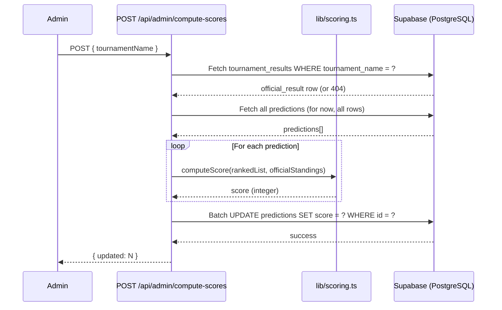

# Design Document: Scoring Engine

## Overview

The Scoring Engine evaluates user predictions against official tournament results and persists numeric scores so the leaderboard can rank users meaningfully. It is a server-side module triggered by an admin after a tournament concludes.

The feature adds:

- A `tournament_results` table to store official final standings
- A `score` column on the existing `predictions` table
- A pure scoring algorithm (TypeScript function) that computes points per prediction
- A Next.js API route (`POST /api/admin/compute-scores`) that orchestrates retrieval, computation, and persistence
- Updates to the leaderboard page to display scores and sort by them
- A user profile score display

The scoring formula is simple and deterministic:

- **3 points** for an exact position match
- **1 point** for a position off by exactly one
- **0 points** for any other offset

---

## Architecture



**Key design decisions:**

- The scoring algorithm lives in `lib/scoring.ts` as a pure function — no I/O, no side effects. This makes it trivially testable.
- The API route handles all I/O (Supabase reads/writes) and delegates computation to the pure function.
- The API route uses the Supabase **service role key** (server-side only) to bypass RLS when writing scores, keeping public clients unable to manipulate scores.
- Leaderboard ordering is done in the SQL query (`ORDER BY score DESC NULLS LAST, created_at ASC`) rather than in application code.

---

## Components and Interfaces

### `lib/scoring.ts` — Pure Scoring Function

```typescript
export interface PlayerEntry {
  rank: number; // 1-based position in the list
  id: string;
  name: string;
}

/**
 * Computes the score for a single prediction against official standings.
 * Returns a non-negative integer.
 */
export function computeScore(
  rankedList: PlayerEntry[],
  officialStandings: PlayerEntry[],
): number;
```

The function builds a lookup map `{ [playerId]: officialRank }` from `officialStandings`, then iterates `rankedList`. For each player:

- If the player is not in the official standings → 0 points (requirement 3.6)
- If `|predictedRank - officialRank| === 0` → 3 points
- If `|predictedRank - officialRank| === 1` → 1 point
- Otherwise → 0 points

### `app/api/admin/compute-scores/route.ts` — API Route

```typescript
// POST /api/admin/compute-scores
// Body: { tournamentName: string }
// Auth: requires admin role (checked via Supabase JWT claim)
// Returns: { updated: number } | { error: string }
```

Steps:

1. Verify the caller has the `admin` role (read from Supabase session/JWT).
2. Fetch the `tournament_results` row for `tournamentName`.
3. If not found, return `404` with a descriptive error — no predictions are modified.
4. Fetch all `predictions` rows.
5. For each prediction, call `computeScore(prediction.ranked_list, officialStandings)`.
6. Batch-update `predictions.score` using the service role client.
7. Return `{ updated: N }`.

### `lib/supabase-server.ts` — Server-Side Supabase Client

A new file that creates a Supabase client using the **service role key** (`SUPABASE_SERVICE_ROLE_KEY`), used only in API routes. This client bypasses RLS and must never be exposed to the browser.

```typescript
import { createClient } from "@supabase/supabase-js";

export const supabaseAdmin = createClient(
  process.env.NEXT_PUBLIC_SUPABASE_URL!,
  process.env.SUPABASE_SERVICE_ROLE_KEY!,
);
```

### `app/leaderboard/page.tsx` — Updated Leaderboard

Changes:

- Query updated to `ORDER BY score DESC NULLS LAST, created_at ASC`
- Each prediction card shows the score (or "Pending" badge if `null`)
- Rank position numbers added (1st, 2nd, 3rd…) based on sorted order

### `app/profile/page.tsx` — New User Profile Page

Displays the logged-in user's predictions with:

- Tournament name
- Score (or "Awaiting Results" if `null`)
- Submitted ranked list

---

## Data Models

### New Table: `tournament_results`

```sql
CREATE TABLE tournament_results (
  id               uuid DEFAULT gen_random_uuid() PRIMARY KEY,
  tournament_name  text NOT NULL CHECK (char_length(tournament_name) > 0),
  final_standings  jsonb NOT NULL,
  created_at       timestamp with time zone DEFAULT timezone('utc', now()) NOT NULL,
  CONSTRAINT final_standings_non_empty CHECK (jsonb_array_length(final_standings) > 0)
);

-- RLS
ALTER TABLE tournament_results ENABLE ROW LEVEL SECURITY;

-- Only admin role may insert/update
CREATE POLICY "Admin insert" ON tournament_results
  FOR INSERT TO authenticated
  WITH CHECK (auth.jwt() ->> 'role' = 'admin');

CREATE POLICY "Admin update" ON tournament_results
  FOR UPDATE TO authenticated
  USING (auth.jwt() ->> 'role' = 'admin');

-- Public read
CREATE POLICY "Public read" ON tournament_results
  FOR SELECT USING (true);
```

`final_standings` JSONB schema (array of `PlayerEntry`):

```json
[
  { "rank": 1, "id": "4", "name": "Gukesh D" },
  { "rank": 2, "id": "1", "name": "Magnus Carlsen" }
]
```

### Modified Table: `predictions`

```sql
ALTER TABLE predictions ADD COLUMN score integer DEFAULT NULL;

-- Prevent public clients from writing the score column
-- (enforced by using service role key server-side; anon key cannot update score)
CREATE POLICY "No public score update" ON predictions
  FOR UPDATE USING (false);
```

The existing `ranked_list` JSONB column already stores `PlayerEntry[]` — no migration needed for its structure.

### TypeScript Types

```typescript
// Shared types (lib/types.ts)
export interface PlayerEntry {
  rank: number;
  id: string;
  name: string;
}

export interface Prediction {
  id: string;
  user_name: string;
  ranked_list: PlayerEntry[];
  score: number | null;
  created_at: string;
}

export interface TournamentResult {
  id: string;
  tournament_name: string;
  final_standings: PlayerEntry[];
  created_at: string;
}
```

---
