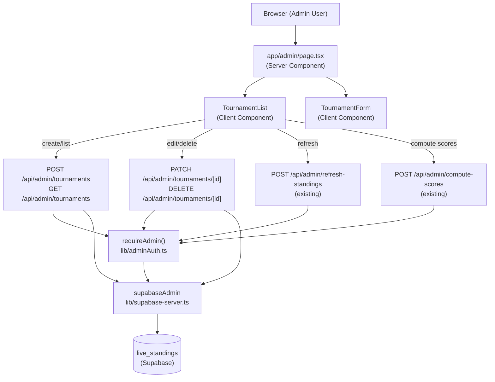
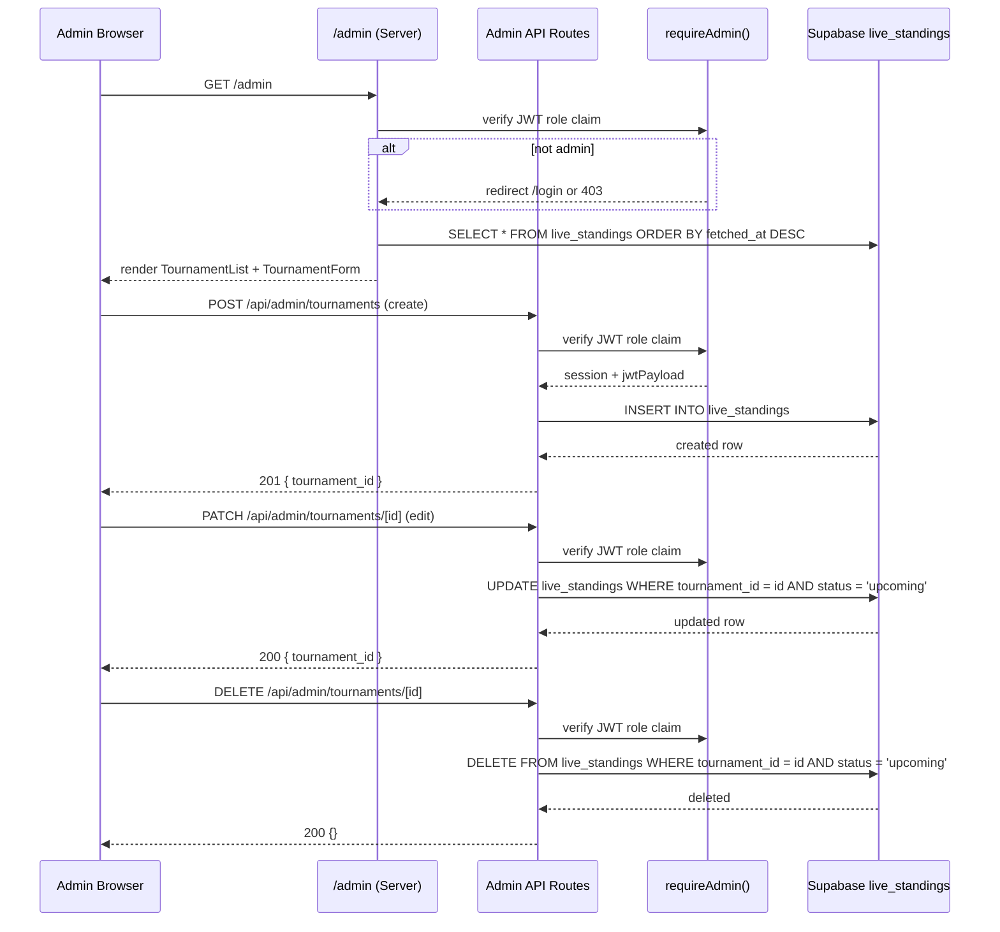

# Design Document: Tournament Creation System

## Overview

The Tournament Creation System adds an admin dashboard at `/admin` that lets authenticated admin users create, view, edit, and delete chess tournaments without touching code or the database directly. It builds on the existing Next.js 14 App Router project, Supabase backend, and the already-wired `lib/poller.ts` / `lib/scoring.ts` infrastructure.

The feature introduces:

- A protected server-rendered page at `app/admin/page.tsx`
- Two new API route files: `app/api/admin/tournaments/route.ts` (POST create, GET list) and `app/api/admin/tournaments/[id]/route.ts` (PATCH edit, DELETE)
- Two new React client components: `TournamentForm` and `TournamentList`
- A shared `requireAdmin` helper that centralises JWT role-claim verification
- Two new columns (`start_date`, `end_date`) on `live_standings`

The existing `POST /api/admin/refresh-standings` and `POST /api/admin/compute-scores` routes are reused as-is; the dashboard simply calls them with the correct payload.

---

## Architecture



### Request / Response Flow



---

## Components and Interfaces

### `lib/adminAuth.ts` — Shared Auth Helper

Extracts the repeated JWT-verification logic from existing routes into a single reusable function.

```typescript
export type AdminAuthResult =
  | { ok: true; userId: string }
  | { ok: false; response: NextResponse };

export async function requireAdmin(): Promise<AdminAuthResult>;
```

- Reads cookies, builds a per-request Supabase client, calls `getSession()`.
- Parses the JWT payload and checks `role === 'admin'`.
- Returns `{ ok: true, userId }` on success or `{ ok: false, response }` with a pre-built 403 `NextResponse` on failure.
- All four admin routes (`tournaments`, `tournaments/[id]`, `refresh-standings`, `compute-scores`) call this at the top of every handler.

---

### `app/api/admin/tournaments/route.ts`

**GET** — list all tournaments

```
GET /api/admin/tournaments
Authorization: Supabase session cookie

Response 200: LiveStandings[]   (ordered by fetched_at DESC)
Response 403: { error: string }
```

**POST** — create a tournament

```
POST /api/admin/tournaments
Content-Type: application/json

Body: {
  tournament_id: string        // unique external ID
  tournament_name: string
  source: "lichess" | "chessdotcom"
  start_date: string           // ISO date
  end_date: string             // ISO date
  standings: PlayerEntry[]     // initial roster, rank assigned by order
}

Response 201: { tournament_id: string }
Response 403: { error: string }
Response 409: { error: "Tournament ID already exists" }
Response 422: { error: string }   // date validation or roster < 2
```

---

### `app/api/admin/tournaments/[id]/route.ts`

**PATCH** — edit an upcoming tournament

```
PATCH /api/admin/tournaments/:id
Content-Type: application/json

Body: {
  tournament_name?: string
  source?: "lichess" | "chessdotcom"
  start_date?: string
  end_date?: string
  standings?: PlayerEntry[]
}

Response 200: { tournament_id: string }
Response 403: { error: string }
Response 404: { error: string }
Response 409: { error: "Cannot edit a non-upcoming tournament" }
Response 422: { error: string }
```

**DELETE** — delete an upcoming tournament

```
DELETE /api/admin/tournaments/:id

Response 200: {}
Response 403: { error: string }
Response 404: { error: string }
Response 409: { error: "Cannot delete a non-upcoming tournament" }
```

---

### `components/TournamentForm.tsx` — Client Component

Props:

```typescript
interface TournamentFormProps {
  initialValues?: TournamentFormValues; // present when editing
  tournamentId?: string; // present when editing
  onSuccess: (tournamentId: string) => void;
  onCancel?: () => void;
}
```

State:

- `fields`: controlled form state for all text/date/select inputs
- `roster`: `PlayerEntry[]` — the live player list
- `errors`: field-level validation errors
- `submitting`: boolean — disables submit button during in-flight request
- `serverError`: string | null — displays API error inline

Roster management methods (pure functions, exported for testing):

```typescript
export function addPlayer(
  roster: PlayerEntry[],
  id: string,
  name: string,
): PlayerEntry[];
export function removePlayer(
  roster: PlayerEntry[],
  index: number,
): PlayerEntry[];
export function reorderPlayers(
  roster: PlayerEntry[],
  fromIndex: number,
  toIndex: number,
): PlayerEntry[];
export function assignRanks(roster: PlayerEntry[]): PlayerEntry[];
```

`assignRanks` always sets `rank = index + 1` for every entry, ensuring sequential ranks after any mutation.

Validation (runs on submit and on blur for date fields):

- All required fields non-empty
- `end_date >= start_date`
- `roster.length >= 2`
- No duplicate player IDs in roster

---

### `components/TournamentList.tsx` — Client Component

Props:

```typescript
interface TournamentListProps {
  initialTournaments: LiveStandings[];
}
```

State:

- `tournaments`: `LiveStandings[]` — local copy, mutated optimistically after API calls
- `editTarget`: `LiveStandings | null` — opens TournamentForm in edit mode
- `deleteTarget`: `LiveStandings | null` — opens confirmation dialog
- `actionState`: per-row loading/error state map

Per-row actions rendered conditionally:
| Status | Edit | Delete | Refresh Standings | Compute Scores |
|-------------|------|--------|-------------------|----------------|
| `upcoming` | ✓ | ✓ | ✓ | |
| `active` | | | ✓ | |
| `completed` | | | | ✓ |

---

### `app/admin/page.tsx` — Server Component

- Calls `requireAdmin()` server-side; redirects to `/login` if unauthenticated, returns 403 if not admin.
- Fetches initial tournament list from Supabase directly (no round-trip through the API route).
- Renders `<TournamentList initialTournaments={...} />` and a "New Tournament" button that opens `<TournamentForm />` in a Dialog.

---

## Data Models

### `live_standings` Schema Changes

Two new columns are added to support date-range tracking:

```sql
ALTER TABLE live_standings
  ADD COLUMN start_date date,
  ADD COLUMN end_date   date;
```

Both columns are nullable to preserve backward compatibility with existing rows created by the poller before this feature was deployed.

Updated TypeScript type in `lib/types.ts`:

```typescript
export interface LiveStandings {
  id: string;
  tournament_id: string;
  tournament_name: string;
  source?: "lichess" | "chessdotcom"; // new optional field
  standings: PlayerEntry[];
  status: TournamentStatus;
  start_date: string | null; // new
  end_date: string | null; // new
  fetched_at: string;
  scored_at: string | null;
}
```

### `TournamentFormValues` (client-side only)

```typescript
interface TournamentFormValues {
  tournament_name: string;
  tournament_id: string;
  source: "lichess" | "chessdotcom" | "";
  start_date: string; // "YYYY-MM-DD"
  end_date: string; // "YYYY-MM-DD"
}
```

### `PlayerEntry` (unchanged, from `lib/types.ts`)

```typescript
interface PlayerEntry {
  rank: number; // 1-indexed, always sequential
  id: string;
  name: string;
}
```

---

## Correctness Properties

_A property is a characteristic or behavior that should hold true across all valid executions of a system — essentially, a formal statement about what the system should do. Properties serve as the bridge between human-readable specifications and machine-verifiable correctness guarantees._

### Property 1: Non-admin requests are always rejected

_For any_ request to any Admin_API endpoint whose JWT payload does not contain `role = 'admin'` (including missing token, wrong role value, or malformed token), the response SHALL be HTTP 403.

**Validates: Requirements 1.2, 1.4**

---

### Property 2: Valid creation produces a correctly-shaped live_standings row

_For any_ valid tournament creation payload (unique `tournament_id`, `end_date >= start_date`, roster of 2+ players), the resulting `live_standings` row SHALL have `status = 'upcoming'`, `standings` equal to the submitted roster with ranks assigned sequentially from 1, and `fetched_at` set to a UTC timestamp within a few seconds of the request.

**Validates: Requirements 2.3, 2.7**

---

### Property 3: Date validation rejects invalid ranges

_For any_ pair `(start_date, end_date)` where `end_date < start_date`, the Admin_API SHALL return HTTP 422 regardless of all other fields being valid.

**Validates: Requirements 2.5, 9.2**

---

### Property 4: Roster rank invariant after add

_For any_ roster of size N, adding a new player with a unique ID SHALL produce a roster of size N+1 where the new player has `rank = N+1` and all existing players retain their original ranks.

**Validates: Requirements 3.2**

---

### Property 5: Roster rank invariant after remove

_For any_ roster of size N (N ≥ 2) and any valid removal index i, removing the player at index i SHALL produce a roster of size N−1 where every remaining player's rank equals their new 1-indexed position in the list.

**Validates: Requirements 3.3**

---

### Property 6: Roster rank invariant after reorder

_For any_ roster and any permutation of its players, the resulting roster SHALL have every player's `rank` equal to their 1-indexed position in the list (i.e., `rank = index + 1` for all entries).

**Validates: Requirements 3.4**

---

### Property 7: Duplicate player ID is always rejected

_For any_ roster containing a player with ID `X`, attempting to add another player with the same ID `X` SHALL leave the roster unchanged and produce a validation error.

**Validates: Requirements 3.5**

---

### Property 8: Roster display completeness

_For any_ roster of players, the rendered roster list SHALL display `rank`, `id`, and `name` for every player in the roster.

**Validates: Requirements 3.6**

---

### Property 9: Tournament list ordering

_For any_ set of tournaments with distinct `fetched_at` timestamps, the displayed list SHALL be ordered strictly by `fetched_at` descending (most recently fetched first).

**Validates: Requirements 4.1**

---

### Property 10: Tournament row display completeness

_For any_ tournament, the rendered list row SHALL contain the tournament's `tournament_name`, `tournament_id`, `status`, and `fetched_at` timestamp.

**Validates: Requirements 4.2**

---

### Property 11: Status-conditional action visibility

_For any_ tournament, the set of actions rendered in its list row SHALL satisfy:

- `status = 'upcoming'` → Edit ✓, Delete ✓, Refresh Standings ✓, Compute Scores ✗
- `status = 'active'` → Edit ✗, Delete ✗, Refresh Standings ✓, Compute Scores ✗
- `status = 'completed'` → Edit ✗, Delete ✗, Refresh Standings ✗, Compute Scores ✓

**Validates: Requirements 4.3, 5.1, 6.1, 7.1, 8.1**

---

### Property 12: Edit is blocked for non-upcoming tournaments

_For any_ tournament with `status` in `['active', 'completed']`, a PATCH request to `/api/admin/tournaments/[id]` SHALL return HTTP 409 regardless of the request body.

**Validates: Requirements 7.4**

---

### Property 13: Delete is blocked for non-upcoming tournaments

_For any_ tournament with `status` in `['active', 'completed']`, a DELETE request to `/api/admin/tournaments/[id]` SHALL return HTTP 409.

**Validates: Requirements 8.4**

---

### Property 14: Edit pre-populates all form fields

_For any_ tournament, opening the edit form SHALL result in every form field (name, source, tournament_id, start_date, end_date) and the roster list matching the tournament's current stored values exactly.

**Validates: Requirements 7.2**

---

### Property 15: Form validation blocks submission on invalid input

_For any_ combination of required fields that are empty or invalid (missing name, missing source, missing tournament_id, missing dates, or roster with fewer than 2 players), the Tournament_Form SHALL display field-level error messages and SHALL NOT call the Admin_API.

**Validates: Requirements 9.1, 9.3**

---

### Property 16: Submit button is disabled during in-flight submission

_For any_ form submission that is currently in progress (awaiting API response), the submit button SHALL be in a disabled state, preventing a second submission.

**Validates: Requirements 9.4**

---

## Error Handling

| Scenario                            | API Response | UI Behaviour                                                   |
| ----------------------------------- | ------------ | -------------------------------------------------------------- |
| Unauthenticated request             | 403          | Redirect to `/login` (server-side)                             |
| Non-admin authenticated request     | 403          | Show "Forbidden" message                                       |
| Duplicate `tournament_id` on create | 409          | Inline form error: "Tournament ID already exists"              |
| `end_date < start_date`             | 422          | Inline error on end date field                                 |
| Roster < 2 players                  | 422          | Inline error on roster section                                 |
| Tournament not found on edit/delete | 404          | Toast error message                                            |
| Edit/delete non-upcoming tournament | 409          | Toast error: "Cannot modify an active or completed tournament" |
| Poller error on refresh             | 502          | Per-row error message with `errorMessage` from poller          |
| Network / unexpected server error   | 500          | Generic toast error; form stays open                           |

All API routes return `{ error: string }` on failure. The client reads `data.error` and surfaces it without navigating away from the current view.

---

## Testing Strategy

### Unit Tests (Vitest)

Focus on pure functions and isolated component behaviour:

- `lib/adminAuth.ts` — `requireAdmin()` with mocked Supabase client: missing session → 403, wrong role → 403, valid admin → ok.
- Roster utility functions (`addPlayer`, `removePlayer`, `reorderPlayers`, `assignRanks`) — example-based tests for specific inputs and edge cases (empty roster, single player, boundary indices).
- `TournamentForm` validation logic — specific examples: all fields empty, end before start, zero players.
- API route handlers — mock `supabaseAdmin` and `requireAdmin`, test each HTTP method with representative inputs.

### Property-Based Tests (fast-check)

Use [fast-check](https://github.com/dubzzz/fast-check) (TypeScript-native, zero extra dependencies beyond dev).

Each property test runs a minimum of **100 iterations**.

Tag format: `// Feature: tournament-creation-system, Property N: <property text>`

Properties to implement as property-based tests:

| Property                   | Test target                 | Generator                                                 |
| -------------------------- | --------------------------- | --------------------------------------------------------- |
| P1: Non-admin rejection    | `requireAdmin()`            | Arbitrary JWT payloads without `role='admin'`             |
| P3: Date validation        | POST /api/admin/tournaments | Arbitrary date pairs where end < start                    |
| P4: Rank after add         | `addPlayer()`               | Arbitrary rosters (0–20 players) + new player             |
| P5: Rank after remove      | `removePlayer()`            | Arbitrary rosters (2–20 players) + removal index          |
| P6: Rank after reorder     | `reorderPlayers()`          | Arbitrary rosters + arbitrary from/to indices             |
| P7: Duplicate ID rejection | `addPlayer()`               | Arbitrary rosters + existing player ID                    |
| P9: List ordering          | `TournamentList` render     | Arbitrary arrays of tournaments with random timestamps    |
| P11: Action visibility     | `TournamentList` row render | Arbitrary tournaments with each of the three statuses     |
| P12: Edit blocked          | PATCH handler               | Arbitrary tournaments with status 'active' or 'completed' |
| P13: Delete blocked        | DELETE handler              | Arbitrary tournaments with status 'active' or 'completed' |
| P15: Form validation       | `TournamentForm`            | Arbitrary combinations of missing/invalid required fields |
| P16: Submit disabled       | `TournamentForm`            | Any form state during in-progress submission              |

Properties P2, P8, P10, P14 are covered by example-based unit tests because they test specific structural/display requirements where a few concrete examples provide equivalent coverage to 100 random iterations.

### Integration Tests

- End-to-end admin flow: create → list → edit → delete using a test Supabase project.
- Refresh standings: verify poller is called with `force: true` and response propagates correctly.
- Compute scores: verify existing route is called with correct `tournamentName`.
